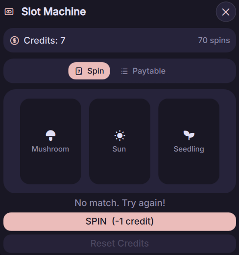
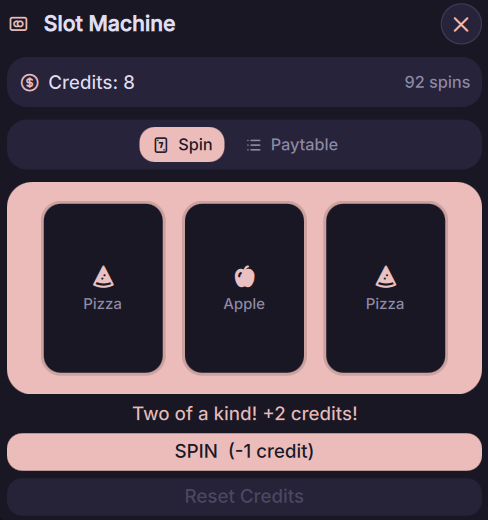
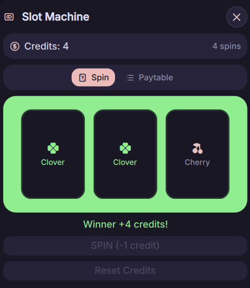
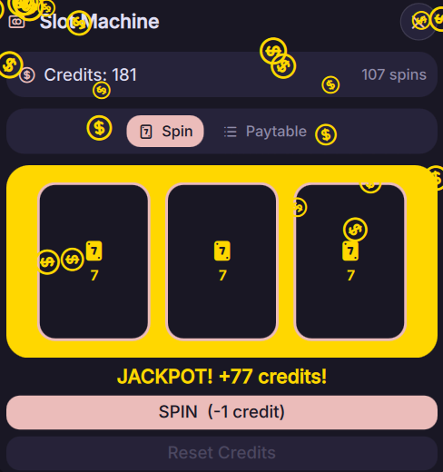

# 🎰 Slot Machine

- **A 777-style slot machine plugin for Noctalia-shell, built with QML. Pure entertainment only, no gambling or betting involved**

## Features

- **Bar Widget**: A compact widget for your bar. Enable "Show Credits" in Settings to display your credits (horizontal bar only)
- **Control Center Widget**: A widget in your control center shortcuts, for people that prefer having no plugin widgets on their bar
- **Icon Color Customization**: Change the bar widget icon color in Settings. It respects your Noctalia colorscheme
- **Dynamic Bar Icon**: The bar icon updates to match the symbol in the middle reel during a spin
- **Paytable**: View all symbols, their rates, and how many credits each combination pays out
- **Reset Credits**: Reset your credits back to default *(15 credits)* when it hits 0

## Installation
1. Navigate to the Noctalia settings plugins section

2. Enter the sources sub-menu

3. Add Slot Machine as a custom repository
```bash
https://github.com/neyfua/slot-machine.git
```

4. Navigate back to Available plugins and search for Slot Machine

5. Click install button

## IPC Commands
- Toggle panel:

```bash
qs -c noctalia-shell ipc call plugin:slot-machine toggle
```

- Spin:

```bash
qs -c noctalia-shell ipc call plugin:slot-machine spin
```

- Reset credits:

```bash
qs -c noctalia-shell ipc call plugin:slot-machine reset
```

## Colors

- The colours are all pulled from your current Noctalia colourscheme.

## Previews

- Normal spin:



- Two of a Kind:



- Winner:



- JACKPOT HAKARI TUCA DONKA SKIBIDI DOP DOP YES YES:



## Requirements

- Gambling addicts 🤑
- ADHD (this plugin might help with your ADHD, tested with the author of this plugin)
- Hakari Kinji fans

## License

- MIT

## Credits

- Thanks [Coin Flip](https://noctalia.dev/plugins/coin-flip/) plugin from Noctalia's official plugins repo for this inspiration
- Thanks [Noctalia docs](https://docs.noctalia.dev/) for the guides/examples
- Thanks other Noctalia plugins for the references
- Thanks Claude being my greatest partner in this time-wasted simple project (you and me was so ass ngl)
